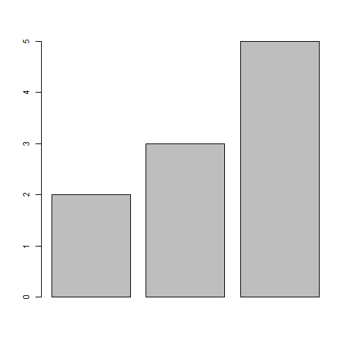

# Addition of 2 numbers
## Assign the values to two variables.

```r
a <- 2;
b <- 3;
```
The numbers that we are going to add are **2** and **3**
## The sum of two numbers are 

```r
s <- a + b;
print(s);
```

```
## [1] 5
```
## Generating a bar plot 

```r
v <- c(a,b,s);
barplot(v);
```

 
