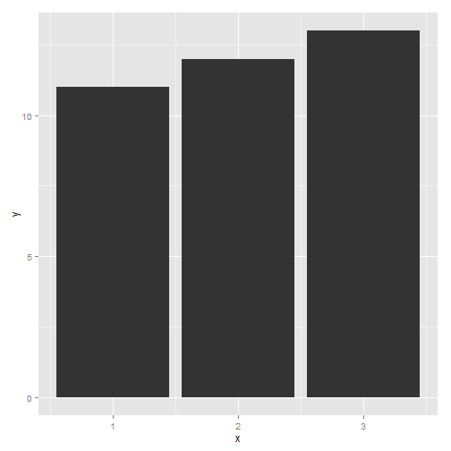

# ***Vintage Data Analysis by Ramakrishna B***
##1. First we need to load the excell data into R.
### Install and load package readxl.


```r
library("readxl");
library(dplyr)
library(stringr);
library(ggplot2);
```

##2. Now define the path and load the vintage file into R.


```r
path = "C:/Users/rbellana/Desktop";
setwd(path);
getwd();
```

```
## [1] "C:/Users/rbellana/Desktop"
```

```r
vintage <- read_excel("Vintage Art V2.1.xlsx",sheet = "Art-i-stick");
head(vintage);
```

```
## Source: local data frame [6 x 26]
## 
##     Cid Art Auction House IsGood Purchase Critic Ratings Buyer No Zip Code
##   (dbl)             (chr)           (dbl)          (dbl)    (dbl)    (dbl)
## 1     1           sotheby               0         8.9046    21973    33619
## 2     2           sotheby               0         9.3593    19638    33619
## 3     3           sotheby               0         7.3807    19638    33619
## 4     4           sotheby               0         6.5617    19638    33619
## 5     5           sotheby               0         6.9367    19638    33619
## 6     6           sotheby               0         8.1054    19638    33619
## Variables not shown: Art Purchase Date (chr), Year of art piece (chr), Acq
##   Cost (dbl), Art Category (chr), Art Piece Size (chr), Border of art
##   piece (chr), Art Type (chr), Prominent Color (chr),
##   CurrentAuctionAveragePrice (dbl), Brush (chr), Brush Size (chr), Brush
##   Finesse (chr), Art Nationality (chr), Top 3 artists (chr),
##   CollectorsAverageprice (dbl), GoodArt check (chr), AuctionHouseGuarantee
##   (chr), Vnst (chr), Is It Online Sale (dbl), Min Guarantee Cost (dbl)
```

##3. Now studying the data.

```r
dim(vintage);   
```

```
## [1] 72983    26
```

```r
names(vintage); 
```

```
##  [1] "Cid"                        "Art Auction House"         
##  [3] "IsGood Purchase"            "Critic Ratings"            
##  [5] "Buyer No"                   "Zip Code"                  
##  [7] "Art Purchase Date"          "Year of art piece"         
##  [9] "Acq Cost"                   "Art Category"              
## [11] "Art Piece Size "            "Border of art piece"       
## [13] "Art Type"                   "Prominent Color"           
## [15] "CurrentAuctionAveragePrice" "Brush"                     
## [17] "Brush Size"                 "Brush Finesse"             
## [19] "Art Nationality"            "Top 3 artists "            
## [21] "CollectorsAverageprice"     "GoodArt check"             
## [23] "AuctionHouseGuarantee"      "Vnst"                      
## [25] "Is It Online Sale"          "Min Guarantee Cost"
```

```r
str(vintage);  
```

```
## Classes 'tbl_df', 'tbl' and 'data.frame':	72983 obs. of  26 variables:
##  $ Cid                       : num  1 2 3 4 5 6 7 8 9 10 ...
##  $ Art Auction House         : chr  "sotheby" "sotheby" "sotheby" "sotheby" ...
##  $ IsGood Purchase           : num  0 0 0 0 0 0 0 0 0 0 ...
##  $ Critic Ratings            : num  8.9 9.36 7.38 6.56 6.94 ...
##  $ Buyer No                  : num  21973 19638 19638 19638 19638 ...
##  $ Zip Code                  : num  33619 33619 33619 33619 33619 ...
##  $ Art Purchase Date         : chr  "41102" "41102" "41102" "41102" ...
##  $ Year of art piece         : chr  "01-01-1952" "01-01-1950" "01-01-1951" "01-01-1950" ...
##  $ Acq Cost                  : num  49700 53200 34300 28700 28000 39200 29400 31500 39200 53900 ...
##  $ Art Category              : chr  "Abstract Art Type I" "Gothic II" "Gothic II" "Gothic II" ...
##  $ Art Piece Size            : chr  "17in. X 27in." "29in. X 3in." "12in. X 20in." "9in. X 12in." ...
##  $ Border of art piece       : chr  "Border 1" "Border 2" "Border 3" "Border 3" ...
##  $ Art Type                  : chr  "Type 1" "Type 2" "Type 3" "Type 4" ...
##  $ Prominent Color           : chr  "Red" "White" "Maroon" "Silver" ...
##  $ CurrentAuctionAveragePrice: num  52157 52192 28245 12908 22729 ...
##  $ Brush                     : chr  "Camel Hair Brush" "Camel Hair Brush" "Camel Hair Brush" "Camel Hair Brush" ...
##  $ Brush Size                : chr  "1" "1" "2" "1" ...
##  $ Brush Finesse             : chr  "Fine" "Fine" "Coarse" "Fine" ...
##  $ Art Nationality           : chr  "European" "American" "American" "American" ...
##  $ Top 3 artists             : chr  "OTHER" "MF Hussain" "MF Hussain" "MF Hussain" ...
##  $ CollectorsAverageprice    : num  86863 89537 60914 38626 55377 ...
##  $ GoodArt check             : chr  "NULL" "NULL" "NULL" "NULL" ...
##  $ AuctionHouseGuarantee     : chr  "NULL" "NULL" "NULL" "NULL" ...
##  $ Vnst                      : chr  "FL" "FL" "FL" "FL" ...
##  $ Is It Online Sale         : num  0 0 0 0 0 0 0 0 0 0 ...
##  $ Min Guarantee Cost        : num  7791 7371 9723 4410 7140 ...
```

```r
head(vintage);
```

```
## Source: local data frame [6 x 26]
## 
##     Cid Art Auction House IsGood Purchase Critic Ratings Buyer No Zip Code
##   (dbl)             (chr)           (dbl)          (dbl)    (dbl)    (dbl)
## 1     1           sotheby               0         8.9046    21973    33619
## 2     2           sotheby               0         9.3593    19638    33619
## 3     3           sotheby               0         7.3807    19638    33619
## 4     4           sotheby               0         6.5617    19638    33619
## 5     5           sotheby               0         6.9367    19638    33619
## 6     6           sotheby               0         8.1054    19638    33619
## Variables not shown: Art Purchase Date (chr), Year of art piece (chr), Acq
##   Cost (dbl), Art Category (chr), Art Piece Size (chr), Border of art
##   piece (chr), Art Type (chr), Prominent Color (chr),
##   CurrentAuctionAveragePrice (dbl), Brush (chr), Brush Size (chr), Brush
##   Finesse (chr), Art Nationality (chr), Top 3 artists (chr),
##   CollectorsAverageprice (dbl), GoodArt check (chr), AuctionHouseGuarantee
##   (chr), Vnst (chr), Is It Online Sale (dbl), Min Guarantee Cost (dbl)
```

##4. Now we want to split the height and widht of the Art Piece size.

```r
s = str_split(vintage$"Art Piece Size ", "X");
head(s);
```

```
## [[1]]
## [1] "17in. " " 27in."
## 
## [[2]]
## [1] "29in. " " 3in." 
## 
## [[3]]
## [1] "12in. " " 20in."
## 
## [[4]]
## [1] "9in. "  " 12in."
## 
## [[5]]
## [1] "7in. "  " 19in."
## 
## [[6]]
## [1] "22in. " " 6in."
```
			 #####Sample for spliting.
                  #a = "2 X 3";      
                  #s = str_split(a,"X")
				  
				  
##5. Now extracting width and height elements of the column separately. So we use User Defined functions.

```r
get_x= function(ele){
              ele[1]
}
get_y= function(ele){
              ele[2]
}
```

### Applying user defined function for the entire column.

```r
x=sapply(s,FUN=get_x);
y=sapply(s,FUN=get_y);
head(x)
```

```
## [1] "17in. " "29in. " "12in. " "9in. "  "7in. "  "22in. "
```

```r
head(y)
```

```
## [1] " 27in." " 3in."  " 20in." " 12in." " 19in." " 6in."
```

## 6. We are getting as "17in. ",where "in." and space is not required.

```r
x = str_replace(x,"in. "," ");
y = str_replace(y,"in."," ");
```

##7. Now remove the spaces using trim function.

```r
x = str_trim(x);
y = str_trim(y);
```

##8.Now change into integer from character form.

```r
vintage$x = as.integer(x)
vintage$Y = as.integer(y)
```

##9. Column names should be like one word.So replace space with "_".

```r
names(vintage) = str_trim(names(vintage));
names(vintage) = str_replace_all(names(vintage)," ","_");
```


##10. Now arranging the data with X on X axis and y on Y axis

```r
vintage = arrange(vintage,x,y);
```

##11. Now analyzing the height and width of the paints done on basis of brush size and painter.

```r
g3 = ggplot(data= vintage,aes(x=x,y=y,size=vintage$Brush_Size,color=vintage$Brush_Size));
g3 = g3 + geom_point();
g3 = g3 + facet_grid(.~Top_3_artists);  
print(g3);
```

 

##12.

```r
names(vintage)
```

```
##  [1] "Cid"                        "Art_Auction_House"         
##  [3] "IsGood_Purchase"            "Critic_Ratings"            
##  [5] "Buyer_No"                   "Zip_Code"                  
##  [7] "Art_Purchase_Date"          "Year_of_art_piece"         
##  [9] "Acq_Cost"                   "Art_Category"              
## [11] "Art_Piece_Size"             "Border_of_art_piece"       
## [13] "Art_Type"                   "Prominent_Color"           
## [15] "CurrentAuctionAveragePrice" "Brush"                     
## [17] "Brush_Size"                 "Brush_Finesse"             
## [19] "Art_Nationality"            "Top_3_artists"             
## [21] "CollectorsAverageprice"     "GoodArt_check"             
## [23] "AuctionHouseGuarantee"      "Vnst"                      
## [25] "Is_It_Online_Sale"          "Min_Guarantee_Cost"        
## [27] "x"                          "Y"
```

```r
print(g4)
```

```
## Error in print(g4): object 'g4' not found
```


##13. Top 3 Artistist

```r
unique(vintage$"Top_3_artists")
```

```
## [1] "MF Hussain" "OTHER"      "Pablo"      "Rembrandt"  "NULL"
```

```r
t = table(vintage$"Top_3_artists")
barplot(sort(t),horiz = T)
```

 

```r
##14.Count of art by Artists:
### default "stat" for "bars" is 'bin" that gives the count value
```

```r
g = ggplot(data=vintage,aes(x=vintage$"Top_3_artists"))
g = g +  geom_bar(stat="bin",fill= "blue",position ="stack",color = "red");
g = g + geom_bar(width = 0.5,fill= topo.colors(5),color="darkgreen");
g = g + coord_flip();
print(g)
```

 

##15.when the data contains y values in a column, use stat="identity".

```r
df = data.frame(x=1:3,y=11:13)
g = g + ggplot(df,aes(x=x,y=y));
```

```
## Warning: Incompatible methods ("+.gg", "Ops.data.frame") for "+"
```

```
## Error in p + o: non-numeric argument to binary operator
```

```r
g = g + geom_bar(stat = "identity")
print(g)
```

```
## Warning in `[<-.data.frame`(`*tmp*`, nl, value = structure(list(y = c(27, :
## replacement element 1 has 72983 rows to replace 23399 rows
```

```
## Warning in `[<-.data.frame`(`*tmp*`, nl, value = structure(list(y = c(27, :
## replacement element 5 has 72983 rows to replace 23399 rows
```

```
## Warning in `[<-.data.frame`(`*tmp*`, nl, value = structure(list(y = c(27, :
## replacement element 6 has 72983 rows to replace 23399 rows
```

```
## Warning in `[<-.data.frame`(`*tmp*`, nl, value = structure(list(y = c(27, :
## replacement element 1 has 72983 rows to replace 5 rows
```

```
## Warning in `[<-.data.frame`(`*tmp*`, nl, value = structure(list(y = c(27, :
## replacement element 5 has 72983 rows to replace 5 rows
```

```
## Warning in `[<-.data.frame`(`*tmp*`, nl, value = structure(list(y = c(27, :
## replacement element 6 has 72983 rows to replace 5 rows
```

```
## Warning in `[<-.data.frame`(`*tmp*`, nl, value = structure(list(y = c(27, :
## replacement element 1 has 72983 rows to replace 11950 rows
```

```
## Warning in `[<-.data.frame`(`*tmp*`, nl, value = structure(list(y = c(27, :
## replacement element 5 has 72983 rows to replace 11950 rows
```

```
## Warning in `[<-.data.frame`(`*tmp*`, nl, value = structure(list(y = c(27, :
## replacement element 6 has 72983 rows to replace 11950 rows
```

```
## Warning in `[<-.data.frame`(`*tmp*`, nl, value = structure(list(y = c(27, :
## replacement element 1 has 72983 rows to replace 12315 rows
```

```
## Warning in `[<-.data.frame`(`*tmp*`, nl, value = structure(list(y = c(27, :
## replacement element 5 has 72983 rows to replace 12315 rows
```

```
## Warning in `[<-.data.frame`(`*tmp*`, nl, value = structure(list(y = c(27, :
## replacement element 6 has 72983 rows to replace 12315 rows
```

```
## Warning in `[<-.data.frame`(`*tmp*`, nl, value = structure(list(y = c(27, :
## replacement element 1 has 72983 rows to replace 25314 rows
```

```
## Warning in `[<-.data.frame`(`*tmp*`, nl, value = structure(list(y = c(27, :
## replacement element 5 has 72983 rows to replace 25314 rows
```

```
## Warning in `[<-.data.frame`(`*tmp*`, nl, value = structure(list(y = c(27, :
## replacement element 6 has 72983 rows to replace 25314 rows
```

 

##16. Count the "IsGood_Purchase" per Artist.
### weighted column should be numeric to that value, so that we can sum up together.

```r
g1 = ggplot(data=vintage,aes(x=vintage$"Top_3_artists"),weight = vintage$"IsGood_Purchase");
g1 = g1 + geom_bar(width=0.5);
g1 = g1 + coord_flip();
print(g1);
```

 

##17.Art Nationality

```r
g2 = ggplot(data=vintage,aes(x=vintage$"Art_Nationality"));
g2 = g2 + geom_bar(width=0.5,stat = "bin",fill=topo.colors(5));
g2 = g2 + coord_flip();
print(g2);
```

 

### Bin data--> Missing values are currently sliently dropped.

##18.count of arts per prominent colour with data labels

```r
freq = table(vintage$"Prominent_Color")
names(freq)
```

```
##  [1] "Beige"     "Black"     "Blue"      "Brown"     "Gold"     
##  [6] "Green"     "Grey"      "Maroon"    "Not Avail" "Null"     
## [11] "Orange"    "Other"     "Purple"    "Red"       "Silver"   
## [16] "White"     "Yellow"
```

```r
str(freq)
```

```
##  'table' int [1:17(1d)] 1584 7627 10347 436 5231 3194 7887 2046 94 8 ...
##  - attr(*, "dimnames")=List of 1
##   ..$ : chr [1:17] "Beige" "Black" "Blue" "Brown" ...
```

```r
pos = freq + 200
df = data.frame(Poss);
t = data.frame(vintage$"prominent_Color");
head(vintage$"Prominent_Color")
```

```
## [1] "Silver" "Black"  "Grey"   "Black"  "Silver" "Blue"
```


```r
names(iris);
```

```
## [1] "Sepal.Length" "Sepal.Width"  "Petal.Length" "Petal.Width" 
## [5] "Species"
```

```r
iris$"Species"
```

```
##   [1] setosa     setosa     setosa     setosa     setosa     setosa    
##   [7] setosa     setosa     setosa     setosa     setosa     setosa    
##  [13] setosa     setosa     setosa     setosa     setosa     setosa    
##  [19] setosa     setosa     setosa     setosa     setosa     setosa    
##  [25] setosa     setosa     setosa     setosa     setosa     setosa    
##  [31] setosa     setosa     setosa     setosa     setosa     setosa    
##  [37] setosa     setosa     setosa     setosa     setosa     setosa    
##  [43] setosa     setosa     setosa     setosa     setosa     setosa    
##  [49] setosa     setosa     versicolor versicolor versicolor versicolor
##  [55] versicolor versicolor versicolor versicolor versicolor versicolor
##  [61] versicolor versicolor versicolor versicolor versicolor versicolor
##  [67] versicolor versicolor versicolor versicolor versicolor versicolor
##  [73] versicolor versicolor versicolor versicolor versicolor versicolor
##  [79] versicolor versicolor versicolor versicolor versicolor versicolor
##  [85] versicolor versicolor versicolor versicolor versicolor versicolor
##  [91] versicolor versicolor versicolor versicolor versicolor versicolor
##  [97] versicolor versicolor versicolor versicolor virginica  virginica 
## [103] virginica  virginica  virginica  virginica  virginica  virginica 
## [109] virginica  virginica  virginica  virginica  virginica  virginica 
## [115] virginica  virginica  virginica  virginica  virginica  virginica 
## [121] virginica  virginica  virginica  virginica  virginica  virginica 
## [127] virginica  virginica  virginica  virginica  virginica  virginica 
## [133] virginica  virginica  virginica  virginica  virginica  virginica 
## [139] virginica  virginica  virginica  virginica  virginica  virginica 
## [145] virginica  virginica  virginica  virginica  virginica  virginica 
## Levels: setosa versicolor virginica
```

```r
Poss= table(iris$"Species") + 400;
d = merge(vintage, df, by.x="prominent_Color",by.y= "Var1")
```

```
## Error in fix.by(by.x, x): 'by' must specify a uniquely valid column
```


